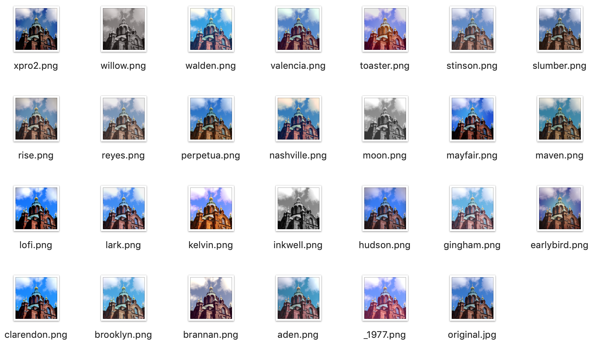

# pilgram

[](https://python.org/pypi/pilgram)
[](https://python.org/pypi/pilgram)
[](https://travis-ci.org/akiomik/pilgram)
[](https://codecov.io/gh/akiomik/pilgram)

A python library for instagram filters.



The filter implementations are inspired by [CSSgram](https://una.im/CSSgram/).

## Requirements

- Python 2 or 3
- [Pillow](https://pillow.readthedocs.io/en/stable/) or [pillow-simd](https://github.com/uploadcare/pillow-simd)

## Install

```sh
pip install pillow # or pip install pillow-simd
pip install pilgram
```

## Usage

Available instagram filters on `pilgram`: `_1977`, `aden`, `brannan`, `brooklyn`, `clarendon`, `earlybird`, `gingham`, `hudson`, `inkwell`, `kelvin`, `lark`, `lofi`, `maven`, `mayfair`, `moon`, `nashville`, `perpetua`, `reyes`, `rise`, `slumber`, `stinson`, `toaster`, `valencia`, `walden`, `willow`, `xpro2`

```python
from PIL import Image
import pilgram

im = Image.open('sample.jpg')
pilgram.aden(im).save('sample-aden.jpg')
```

Similarly, pilgram provides css filters and blend modes as a by-product.

Available css filters on `pilgram.css`: `contrast`, `grayscale`, `hue_rotate`, `saturate`, `sepia`

```python
from PIL import Image
import pilgram.css

im = Image.open('sample.jpg')
pilgram.css.sepia(im).save('sample-sepia.jpg')
```

Available blend modes on `pilgram.css.blending`: `color`, `color_burn`, `color_dodge`, `exclusion`, `hard_light`, `hue`, `overlay`, `soft_light`

```python
from PIL import Image
import pilgram.css.blending

backdrop = Image.open('backdrop.jpg')
source = Image.open('source.jpg')
pilgram.css.blending.color(backdrop, source).save('blending.jpg')
```

## Demo

[](https://colab.research.google.com/github/akiomik/pilgram/blob/master/examples/example.ipynb)

- [examples/example.ipynb](examples/example.ipynb) 

## Test

```sh
pipenv install --dev
make test     # python 3
make test-tox # python 2 and 3
```
